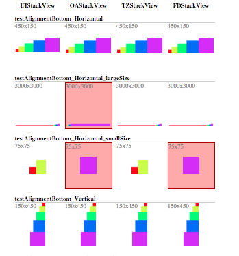

# StackViewTester

StackViewTester is a test suite born from a desire to find a good compatibility library for [UIStackView]. This is accomplised using snapshot comparison. An HTML page can be generated to provide a simple way to compare various stack view implementations with various layouts.




## Tests

StackViewTester has a few components. `VTInterfaceTests` tests that the stack view's public interface matches that of [UIStackView].

The remaining tests setup the stack view state and compare their snapshots. `VTSimpleLayoutTests` tests some non-layout cases such as default state and state after removing/hiding views.

`VTCustomLayoutTests` was created for doing a quick test of a layout with some simple examples already in place for simpler layouts as well as nested stack view layouts.

`VTExhaustiveTests` generates all permutations of stack view values and various parameters to perform an exhaustive test of all stack views. Because of the exponential nature of these tests, it is disabled by default. The results of these tests can be viewed in the [UIStackView Comparison]. This can give some insight into the parameters that cause incompatibilities with each stack view implementation.

## Implementation

StackViewTester works by treating all of the stack views as if they were [UIStackViews][UIStackView]. Unfortunately, they do not all conform to the same interface. The stack views are treated the same by employing [swizzling and associated objects](https://github.com/kwongius/StackViewTester/blob/master/StackViewTesterTests/UIStackView+ViewTester.m).

## Usage

Running the tests requires Cocoapods. You will have to run `pod install` to get the latest version of the libraries.

Running the tests will generate images for the stack views. These will be located in the output of the directory specified by the `VT_OUTPUT_IMAGE_DIR`. By default, this is the `$(SOURCE_ROOT)/Images` directory.

To generate the output HTML page, [fastimage](https://github.com/sdsykes/fastimage) is required.

```bash
bundle install
bundle exec scripts/generate_comparison_page.rb
```

## License

This project is licensed under the terms of the MIT license. See the LICENSE file for more info.

[UIStackView]: https://developer.apple.com/library/ios/documentation/UIKit/Reference/UIStackView_Class_Reference/
[UIStackView Comparison]: http://kwongius.github.io/StackViewTester/
